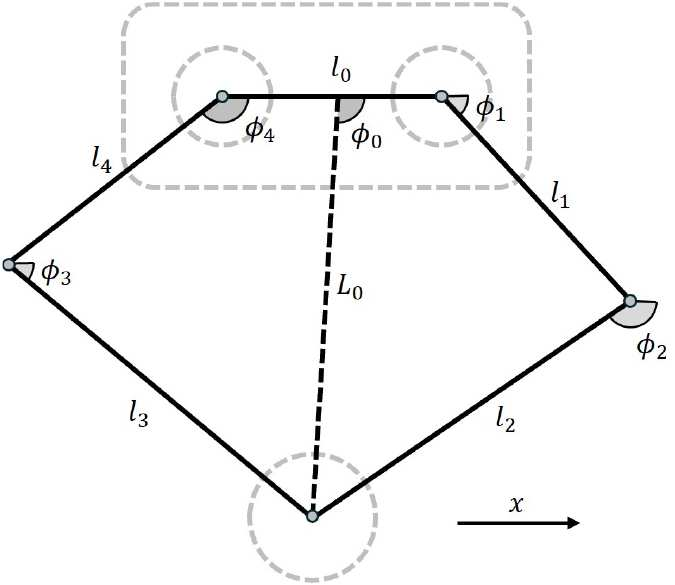
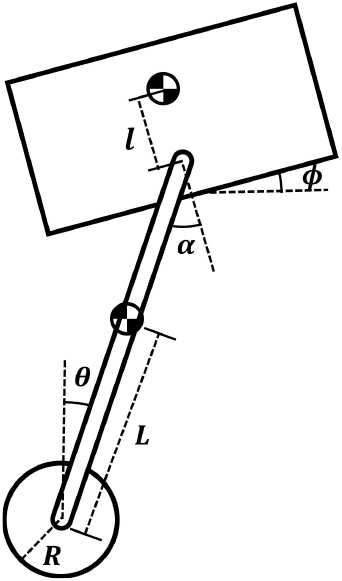
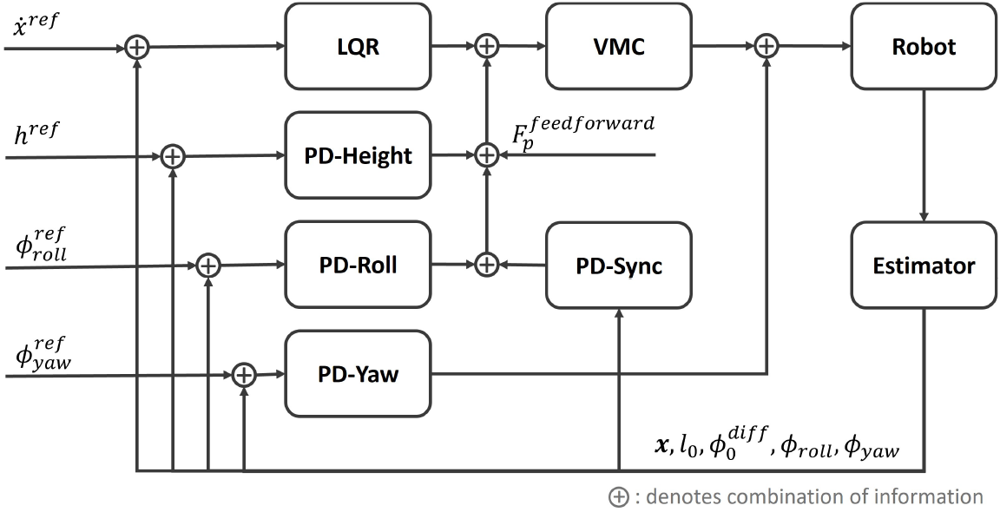
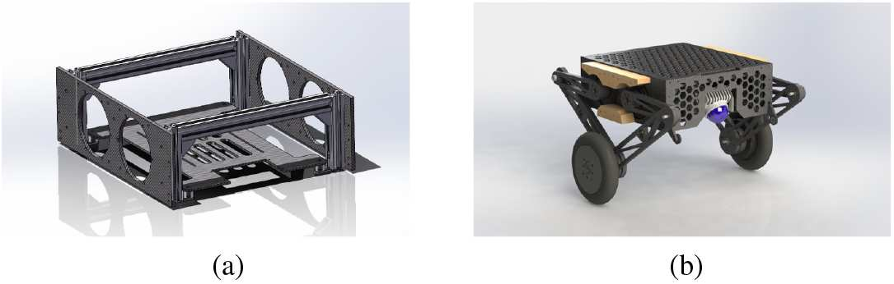
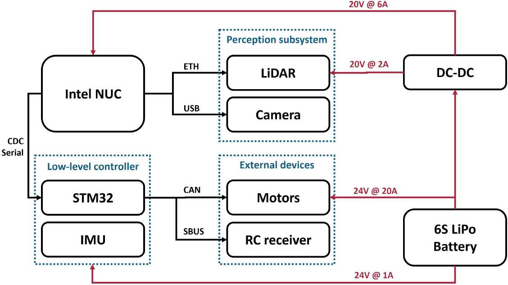
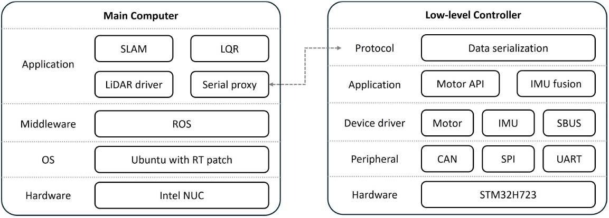

论文整理：自适应鲁棒轮足双足机器人
========================================

本页根据论文 ``Adaptive and Robust Wheel-Legged Biped Robot for Semistructured Community Tasks`` 整理，
仅概括原文第 III 节 ``METHODOLOGY`` 与第 IV 节 ``EXPERIMENT``，用于快速理解该方案的控制思路与实机验证结果。
内容为说明文档形式的简要重述，不替代原论文。

研究主线
--------

1. 将五连杆腿机构等效为便于分析的“虚拟腿”，把复杂机构压缩成可控模型。
2. 用 ``LQR + PD + VMC`` 组成主体控制链路，并配合状态观测器完成姿态与速度估计。
3. 针对真实地面中的坡面、打滑和台阶，加入地形前馈、传感器融合和自动跳跃策略。
4. 通过实机平台和多组实验验证机器人在半结构化环境中的稳定性与通过性。

III. Methodology
----------------

建模：从五连杆到虚拟腿
^^^^^^^^^^^^^^^^^^^^^^

论文首先把单条腿的五连杆结构简化为一条可变长度的虚拟腿，并在二维平面内分析平衡问题。这样做的目的，是把原本较复杂的机构动力学，转化为更易控制的“轮子 + 虚拟腿 + 机身”模型。随后，作者再把虚拟腿上的推力和力矩映射回实际关节电机扭矩。

   图 6：腿部五连杆机构。论文以此为基础，将其进一步等效为虚拟腿。

   图 7：简化后的物理模型。系统主要由机身、车轮和虚拟腿组成，可视为带上部刚体的轮式倒立摆。

平衡控制与整体控制框架
^^^^^^^^^^^^^^^^^^^^^^

在平衡控制部分，论文采用离散时间 ``LQR`` 设计主反馈控制器，并针对不同虚拟腿长度预先计算反馈增益，再通过多项式拟合得到随腿长变化的增益矩阵 ``K(L0)``。这样做的好处是，机器人在腿长变化时仍能保持较一致的平衡控制效果。

除了平衡控制，系统还增加了高度、横滚、偏航和双腿同步等 ``PD`` 控制器，并通过 ``VMC`` 将高层控制量转换为执行器输出。整体上，这是一个“LQR 管平衡、PD 管姿态和高度、VMC 负责力/力矩分配”的复合控制框架。

   图 8：完整控制框架。系统将 LQR 与多个 PD 控制器结合，再统一作用于机器人本体。

状态估计与打滑检测
^^^^^^^^^^^^^^^^^^

由于前面的建模是二维近似，论文额外设计了状态观测器，用 IMU、轮速和腿部运动学信息来估计平衡控制所需状态。对于机体线速度和偏航角速度，作者又单独建立了一个简化的差速模型，并使用卡尔曼滤波融合轮编码器与 IMU 数据。

这一步的关键在于打滑检测。论文通过监测量测残差判断左右轮是否发生异常打滑；一旦残差超过阈值，就减少对应轮速观测对滤波器更新的影响，改用预测值替代异常量测。这样可以避免错误轮速直接进入控制器，引发过大扭矩输出和姿态失稳。

跳跃控制与地形前馈
^^^^^^^^^^^^^^^^^^

在跳跃控制上，论文把一次跳跃划分为四个阶段：压缩、蹬伸、腾空收腿和落地触地。跳跃高度并不是完全依赖精确动力学求解，而是通过实机实验对“目标越障高度”和“控制参数”之间的关系进行拟合，从而降低建模误差对落地效果的影响。

在地形适应上，论文又引入了坡面静力学分析和接触角概念，用于计算地形前馈项。这样一来，机器人在坡面或起伏路面上不再只是被动纠偏，而是可以提前补偿车轮接触状态变化带来的姿态偏差。对于已知地形，系统还会基于预测轨迹检测台阶位置与高度，在满足条件时自动触发跳跃。

IV. Experiment
--------------

实机平台设计
^^^^^^^^^^^^

实验部分首先给出了实机平台设计。作者搭建了一台轮足双足机器人原型机，用来验证上述控制与感知方法是否能够在真实环境中工作。

机械结构方面，机器人主承力框架采用高强度铝型材，以保证跳跃和跌落时的结构强度；其他部件则大量采用中空碳纤维结构，以兼顾减重和刚度。为了更好地感知前方地形，激光雷达以向下倾斜的方式安装，从而提高地面点云利用率。

   图 15：实机机械结构。(a) 主支撑框架；(b) 完整机械结构。

电子硬件方面，主控计算单元为 13 代 ``Intel i7 NUC``，底层控制器为 ``STM32``。系统通过 USB CDC 串口完成上下位机通信，电源由 ``6s LiPo`` 电池提供，并使用降压模块为主控供电。这个设计体现的是“上位机负责高层计算，单片机负责底层驱动与实时接口”的典型分层方案。

   图 16：实机电子系统设计。计算、感知、执行与供电关系都在同一张框图中给出。

软件架构方面，论文强调所有主要计算都在机载完成，不依赖外部计算机。主控运行带实时补丁的 ``ROS`` 系统，包含运动控制、数据传输和 SLAM 等节点；下位机程序则按照外设层、驱动层、应用层和协议层进行分层封装，形成完整控制链路。

   图 17：实机软件架构。主控机与下位机职责清晰分离，上下层通过统一协议协同工作。

运动实验结果
^^^^^^^^^^^^

论文随后使用多组实验验证方法有效性，核心结果可以概括为以下几点：

1. ``速度跟踪``：机器人能够跟踪梯形速度指令，文中实验速度逐步提升至 ``2 m/s``，同时保持机身俯仰角稳定。
2. ``打滑抑制``：在故意制造单侧车轮严重打滑时，融合编码器与 IMU 的卡尔曼滤波能够明显减小错误速度估计，避免机器人因错误反馈而跌倒。
3. ``抗扰恢复``：机器人在遭受外部踢击后，虽然短时间内出现姿态与速度偏差，但控制器能够较快将其恢复到稳定直立状态，文中给出的恢复时间约为 ``2 s``。
4. ``地形前馈``：在坡面实验中，引入地形前馈后，机身俯仰角相对关闭前馈时更接近水平参考值，说明该方法能有效降低地形变化带来的姿态偏移。
5. ``通过性验证``：机器人能够平稳越过 ``3 cm`` 减速带、从 ``40 cm`` 高台跳下并平稳落地，还能结合激光雷达和深度相机构建高程图，自动跳上 ``10 cm`` 台阶。

简要结论
--------

从说明文档角度看，这篇论文最重要的贡献不只是单个控制器，而是把以下几个环节串成了一套可落地系统：

1. 用虚拟腿和轮式倒立摆思想做简化建模。
2. 用 ``LQR + PD + VMC`` 组成稳定的基础运动控制。
3. 用观测器、卡尔曼滤波和残差判定解决实机中的速度估计与打滑问题。
4. 用地形前馈和自动跳跃策略把控制能力扩展到坡面、台阶和跌落等半结构化场景。

因此，论文展示的是一套面向真实社区环境任务的轮足机器人系统方案，而不是仅在理想平地上工作的单一平衡控制方法。
