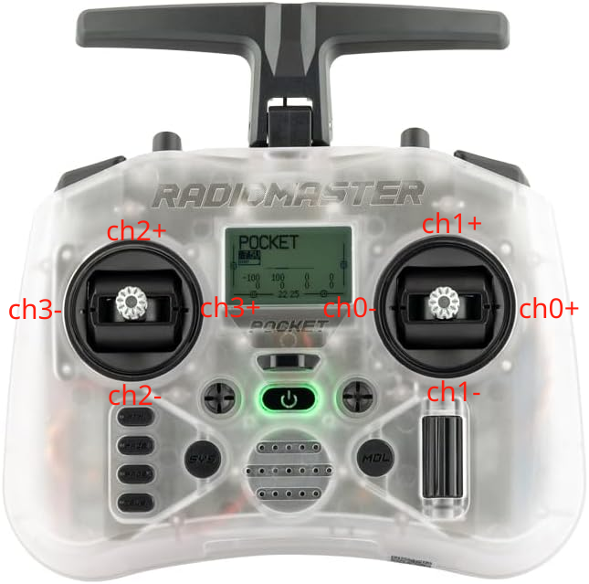
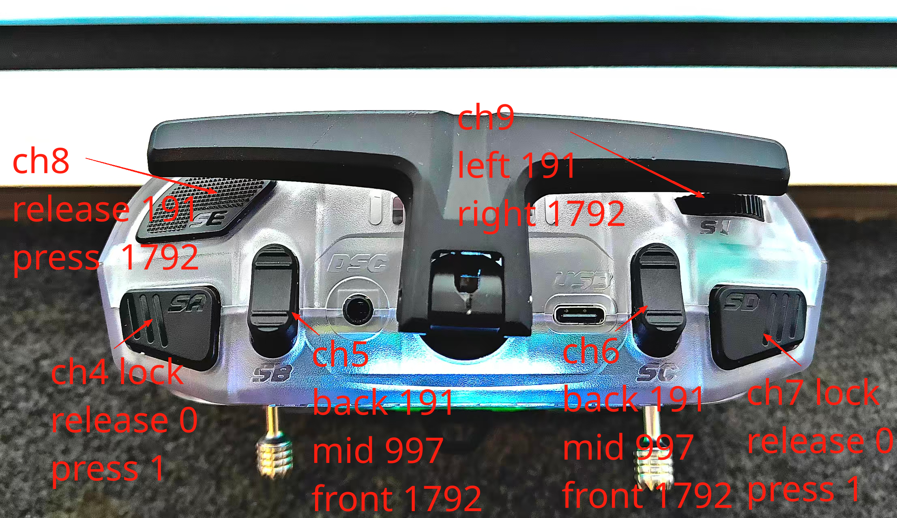

ROS 接口说明
============

传感器消息
----------

``sensor_msgs/JointState`` (ROS 内置):

.. code-block:: text

   std_msgs/Header header
   string[] name
   float64[] position
   float64[] velocity
   float64[] effort

``sensor_msgs/Imu`` (ROS 内置):

.. code-block:: text

   std_msgs/Header header
   geometry_msgs/Quaternion orientation
   float64[9] orientation_covariance
   geometry_msgs/Vector3 angular_velocity
   float64[9] angular_velocity_covariance
   geometry_msgs/Vector3 linear_acceleration
   float64[9] linear_acceleration_covariance

SBUS 遥控映射
-------------

基于当前代码行为（边沿触发 + 阈值）：

1. ``ch4 (SA)``：软急停切换（阈值 ``992``，边沿触发 ``force_stop_mode``）。
2. ``ch7 (SD)``：``/force_disable`` 切换（阈值 ``992``）。
3. ``ch8 (SE)``：站立 / 跳跃 / wink 状态触发（受 stop 与 standing 条件限制）。
4. ``ch6 (SC)``：NNMPC 模式开关（阈值 ``600``，开启时重置参考量）。
5. ``ch5 (SB)``：速度档位（``>=600`` 快速模式，``<600`` 普通模式）。
6. ``ch1``：``x_vel_target``，以 ``992`` 为中心线性映射。
7. ``ch0``：``yaw_vel_target``，以 ``992`` 为中心线性映射，符号为负。
8. ``ch2``：``l0_pid_ref = 0.25 + scaled_input``。
9. ``ch3``：``roll_pid_ref = 0.05 + scaled_input``。
10. ``ch9 (SF)``：跳跃允许与高度映射（``>200`` 可跳跃）。

遥控器通道示意
--------------

摇杆通道（``ch0`` 到 ``ch3``）：

   摇杆通道示意。右摇杆对应 ``ch0`` / ``ch1``，左摇杆对应 ``ch2`` / ``ch3``。

开关与拨钮通道（``ch4`` 到 ``ch9``）：

   顶部和肩部开关通道示意。图中同时标出了几个常见原始值：两档通道约为 ``191`` / ``1792``，三档通道约为 ``191`` / ``997`` / ``1792``。

逐通道说明
----------

摇杆通道（ch0 到 ch3）：

1. ``ch0``：右摇杆左右，控制 ``yaw_vel_target``。代码中对该通道乘了负号，所以通道正方向不等于机器人正角速度方向。
2. ``ch1``：右摇杆上下，控制 ``x_vel_target``，中心值约为 ``992``。
3. ``ch2``：左摇杆左右，控制腿长参考 ``l0_pid_ref``。
4. ``ch3``：左摇杆上下，控制 ``roll_pid_ref``。

开关/拨钮通道（ch4 到 ch9）：

1. ``ch4 (SA)``：软急停开关。跨过 ``992`` 阈值时切换 ``force_stop_mode``。
2. ``ch5 (SB)``：速度档位开关。原始值通常是 ``191`` / ``997`` / ``1792``，但当前代码只按 ``600`` 阈值判断，所以中档和前档都会进入快速模式。
3. ``ch6 (SC)``：控制 ``NNMPC`` 模式开关。和 ``ch5`` 一样，当前代码只区分 ``<600`` 和 ``>=600`` 两档。
4. ``ch7 (SD)``：底层失能开关，切换时会发布 ``/force_disable``。
5. ``ch8 (SE)``：动作触发键。根据当前停机/站立/跳跃状态，可触发站立、跳跃或眨眼动画。
6. ``ch9 (SF)``：跳跃高度拨轮。``>200`` 时允许跳跃，同时连续映射跳跃高度。

原始值与阈值
------------

结合当前图片和代码，可按下面的经验值理解遥控器输入：

1. 两个摇杆的中心位置约为 ``992``，偏转后围绕该中心做线性映射。
2. 两档开关常见原始值接近 ``191`` 与 ``1792``，代码通常用 ``992`` 作为翻转阈值。
3. 三档开关常见原始值接近 ``191`` / ``997`` / ``1792``，当前代码对 ``SB``、``SC`` 只用 ``600`` 做二值判断。
4. ``SF`` 拨轮除了 ``allow_jump`` 的门限判断，还会继续参与跳跃高度计算，因此它不是简单的开/关量。

控制输出逻辑
------------

``control_callback`` 的核心分支可概括为：

.. code-block:: text

   if not force_stop_mode:
       full joint torque output
   elif standing:
       only wheel torque output
   else:
       all torque zero

这表示系统在急停后仍可在站立状态下保留轮扭矩，完全非站立时才清零所有执行器。

调试命令
--------

.. code-block:: bash

   rostopic list
   rostopic echo /joint_state
   rostopic echo /imu
   rostopic echo /sbus
   rostopic hz /torque_command
   rosnode info controller
   rosnode info serial_proxy
