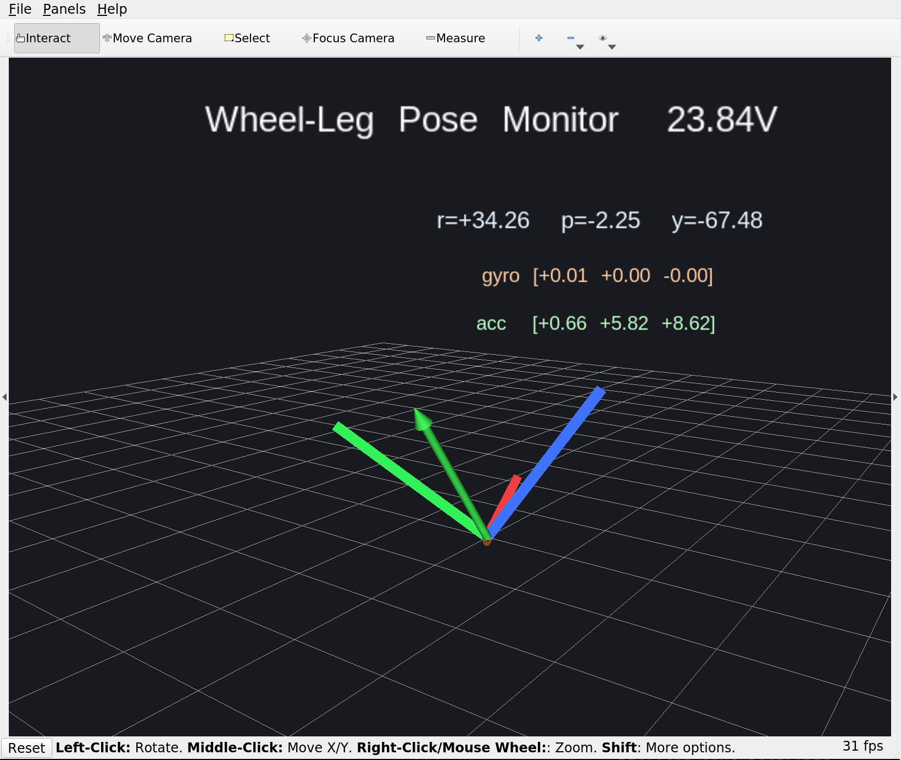
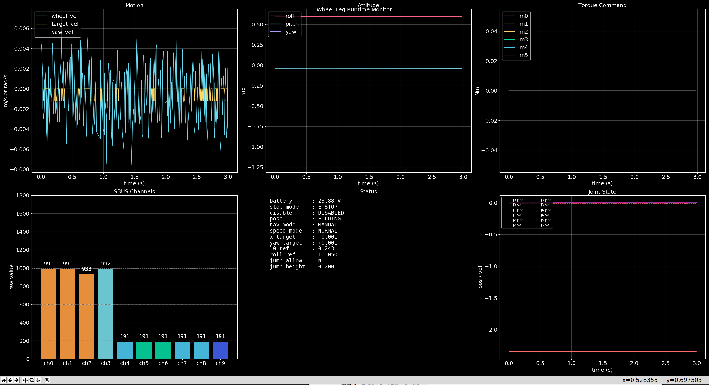

WLClient 监控客户端
===================

定位
----

``WLClient`` 目录对应的 ROS 包名为 ``wl_client``。它是一个轻量级监控客户端，用于在联调阶段同时查看机器人姿态、遥控输入、关节状态、扭矩指令和电池电压。

相比直接使用 ``rostopic echo``，``wl_client`` 更适合做以下工作：

1. 快速确认 IMU 姿态和方向是否正常。
2. 在一页界面里观察速度、姿态、扭矩和 SBUS 通道变化。
3. 上电联调时确认遥控开关状态、电池电压和关节反馈是否同步更新。

功能组成
--------

``monitor.launch`` 默认会启动以下组件：

1. ``wl_monitor.py``：发布 ``wl_client/markers``，在 RViz 中显示姿态坐标轴、角速度、线加速度和电池电压。
2. ``wl_scope.py``：打开一个实时监控窗口，集中显示运动趋势、姿态曲线、扭矩命令、SBUS 通道、状态面板和关节状态。
3. ``rviz``：加载 ``config/wl_monitor.rviz``，直接展示可视化结果。

快速启动
--------

如果只想单独编译这个包，可以在 catkin 工作空间下执行：

.. code-block:: bash

   catkin_make -DCATKIN_WHITELIST_PACKAGES=wl_client
   source devel/setup.bash
   roslaunch wl_client monitor.launch

常用启动参数：

.. code-block:: bash

   roslaunch wl_client monitor.launch open_rviz:=false
   roslaunch wl_client monitor.launch open_scope:=false
   roslaunch wl_client monitor.launch frame_id:=base_link publish_rate:=20.0

其中：

1. ``open_rviz`` 控制是否自动打开 RViz。
2. ``open_scope`` 控制是否打开 matplotlib 监控面板。
3. ``frame_id`` 控制 RViz Marker 使用的坐标系，默认值为 ``imu_link``。
4. ``publish_rate`` 控制姿态 Marker 的刷新频率，默认值为 ``10.0`` Hz。

话题依赖
--------

``wl_client`` 默认订阅以下话题：

1. ``/imu``（``sensor_msgs/Imu``）
2. ``/joint_state``（``sensor_msgs/JointState``）
3. ``/sbus``（``std_msgs/Float32MultiArray``）
4. ``/torque_command``（``std_msgs/Float32MultiArray``）
5. ``/power_voltage``（``std_msgs/Float32``）
6. ``/debug_plot``（``std_msgs/Float32MultiArray``）

它会发布：

1. ``wl_client/markers``（``visualization_msgs/MarkerArray``）

界面示例
--------

RViz 姿态监视界面：

   ``wl_monitor.py`` 会根据 IMU 数据绘制姿态坐标轴，并叠加角速度、线加速度和电池电压信息。

综合监控面板：

   ``wl_scope.py`` 将运动、姿态、扭矩、SBUS、状态和关节反馈集中到同一窗口，适合联调和录屏排查。

使用建议
--------

1. 首次上电时优先观察 ``SBUS Channels`` 和 ``Status`` 面板，确认急停、使能和站立状态是否符合预期。
2. 如果 RViz 坐标轴方向异常，先检查 IMU 安装方向和 ``frame_id`` 设置。
3. 如果曲线窗口无法弹出，通常是图形界面环境或 matplotlib 后端问题，不影响 ROS 话题本身收发。
